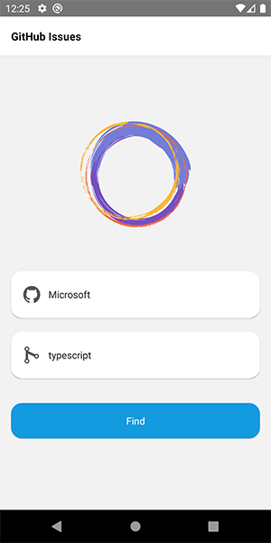
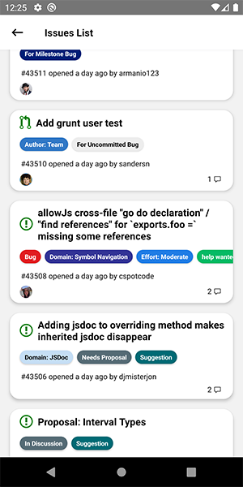
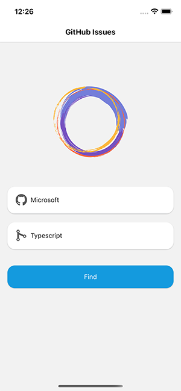
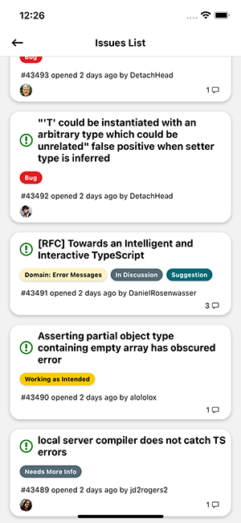

## About
A basic mobile application that allows user to browse GitHub issues.

## Setup
First clone this Repo and run the following command:
`yarn` or `npm install`.

To run on iOS use `react-native run-ios` and for android use `react-native run-android`.

To test this application use `yarn test` or `npm test`.

## About Github Issues API
List issues assigned to the authenticated user across all visible repositories including owned repositories, member repositories, and organization repositories. You can use the filter query parameter to fetch issues that are not necessarily assigned to you.

Example API:
* https://api.github.com/repos/microsoft/typescript/issues

## React-Native Packages Used
    "@react-native-community/masked-view": "^0.1.10",
    "@react-native-community/netinfo": "^6.0.0",
    "axios": "^0.21.1",
    "moment": "^2.29.1",
    "prop-types": "^15.7.2",
    "react": "17.0.1",
    "react-native": "0.64.0",
    "react-native-gesture-handler": "^1.10.3",
    "react-native-reanimated": "^2.1.0",
    "react-native-router-flux": "^4.3.1",
    "react-native-safe-area-context": "^3.2.0",
    "react-native-screens": "^3.0.0",
    "react-native-splash-screen": "^3.2.0",
    "react-native-vector-icons": "^8.1.0",
    "react-redux": "^7.2.3",
    "redux": "^4.0.5"
    
## Important Dev Packages Used
    "@testing-library/jest-native": "^4.0.1",
    "@testing-library/react-native": "^7.2.0",
    "jest": "^26.6.3",
    "react-test-renderer": "^17.0.2"
    
## Screenshots
Android:

iOS:

